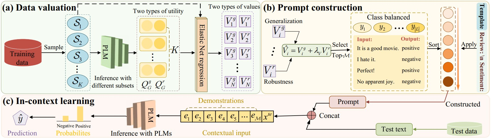
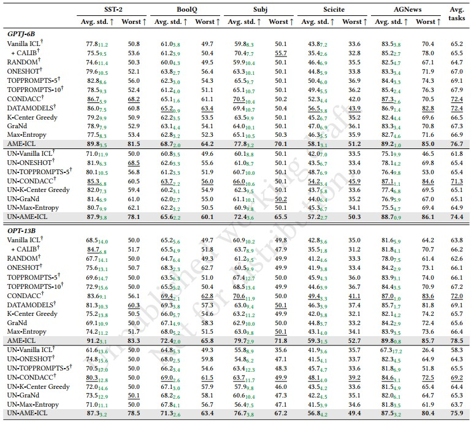

## AME-ICL


## Valuing Training Data via Causal Inference for In-Context Learning

This repository contains the code of "Valuing Training Data via Causal Inference for In-Context Learning".

<p align="center">
  
</p>


>
> **Abstract:** *In-context learning (ICL) empowers large pre-trained language models (PLMs) to predict outcomes for unseen inputs without parameter updates. However, the efficacy of ICL heavily relies on the choice of demonstration examples. Randomly selecting from the training set frequently leads to inconsistent performance. Addressing this challenge, this study takes a novel approach by focusing on training data valuation through causal inference. Specifically, we introduce the concept of average marginal effect (AME) to quantify the contribution of individual training samples to ICL performance, encompassing both its generalization and robustness. Drawing inspiration from multiple treatment effects and randomized experiments, we initially sample diverse training subsets to construct prompts and evaluate the ICL performance based on these prompts. Subsequently, we employ Elastic Net regression to collectively estimate the AME values for all training data, considering subset compositions and inference performance. Ultimately, we prioritize samples with the highest values to prompt the inference of the test data. Across various tasks and with seven PLMs ranging in size from 0.8B to 33B, our approach consistently achieves state-of-the-art performance. Particularly, it outperforms Vanilla ICL and the best-performing baseline by an average of 14.1\% and 5.2\%, respectively. Moreover, prioritizing the most valuable samples for prompting leads to a significant enhancement in performance stability and robustness across various learning scenarios. Impressively, the valuable samples exhibit transferability across diverse PLMs and generalize well to out-of-distribution tasks.*


## Content


1. [Baselines](#baselines)
2. [Evaluation](#evaluation)
3. [Data](#data)


## Baselines
The following scripts will run all baselines.
### Labeled Setup
```
sh scripts/run_label.sh
```
### Unlabeled Setup
```
sh scripts/run_unlabel.sh
```

## Evaluation

- Obtaining data values in terms of generalization

```
python select_AMEICL.py --s_n 100 --train_path train_path --test_path test_path --dev_path dev_path
```
- Obtaining data values in terms of robustness
```
python select_AMEICL_robust.py --s_n 100 --rob_bound 0.1 --train_path train_path --test_path test_path --dev_path dev_path
```

Or run the script:

```
sh scripts/run-select.sh
```

- Constructing prompts and conducting ICL inference
```
python evaluate_AMEICL.py --m 4 --l 1 --train_path train_path --test_path test_path --dev_path dev_path --gene_value_path gene_value_path --rob_value_path rob_value_path
```
Or run the script:

```
sh scripts/run.sh
```

- Evaluating robustness performance
```
python evaluate_AMEICL_robust.py --m 4 --l 1 --rob_bound 0.1 --train_path train_path --test_path test_path --dev_path dev_path --gene_value_path gene_value_path --rob_value_path rob_value_path
```


## Data
- We include the data in [`data/`](data/). The files are organized as follow:
```
data
├── glue-sst2
│   ├── *train.jsonl
│   ├── *dev.jsonl
│   ├── *test.jsonl
│   └── unlabeled
│       ├── *train.jsonl
│       └── is_groundtruth.npy
├── boolq/
├── subj/
├── scicite/
├── glue-mnli/
└── ag_news/
```
- Each task folder contains `*train.jsonl, *dev.jsonl, *test.jsonl`, the gold-labeled train/dev/test splits, and the unlabeled training set `unlabeled/*train.jsonl`. 
- Note that both the labeled and unlabeled setups use the same dev sets for method developement and are evaluated on the same test sets.
- To reproduce the data creation for the unlabeled setups, see `create_unlabeled.py`


## Results
Main comparison results:
<p align="center">
  
</p>

For all results, please check our paper.

